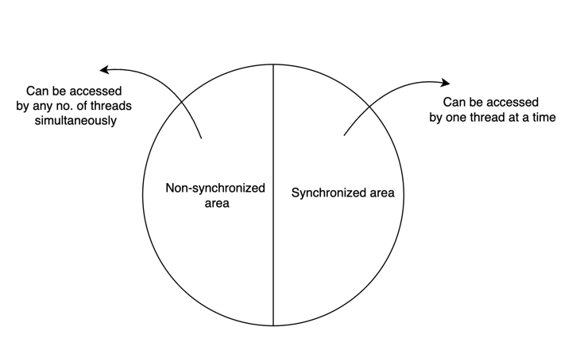

# Synchronization

If a method or block is declared as **synchronized** then at a time only one thread is allowed to execute that method or block on the given object so that data inconsistency problem will be resolved


### Advantage:
- We can overcome data inconsistency problem

### Disadvantage:
- It increases waiting time of threads and creates performance problems

Hence, if there is no specific requirement then it is not recommended to use synchronized keyword

---

Internally synchronization concept is implemented by using **LOCK**

Every object in Java has a unique lock.
Whenever we are using synchronized keyword then only LOCK concept will come into the picture

If a thread wants to execute Synchronized method on the given object first it has to get the lock of the object
Once thread gets the lock, then it is allowed to execute any synchronized method on that object. 

Once method execution completes, automatically thread releases the lock

(Acquiring and releasing the lock is taken care of internally by JVM. Programmer not responsible for this activity)

While a thread executing synchronized method on the given object, the remaining threads are not allowed to execute any synchronized methods simultaneously on the same object
But remaining threads are allowed to execute non-synchronized methods simultaneously

```java
class demo{
    synchronized m1();
    synchronized m2();
    m3();
}

t1.m1()
t2.m1()
t3.m2()
t4.m3()
```
since t1 already has the lock, t2 and t2 will be in waiting state since they are executing synchronized method of same object

While t4 can access m3() immediately since it is non-synchronized

Lock concept is implemented based on object but not on method



---

## If threads using same instance of class

```java
class Display {
    String name;

    public void syncWithBlock() {
        synchronized (this) {
            for (int i = 0; i < 5; i++)
                System.out.println(name);
        }
    }
}
```

To achieve similar result using synchronized keyword in method signature 

```java
class Display {
    String name;

    public synchronized void syncWithSign() {
        for (int i = 0; i < 5; i++)
            System.out.println(name);
    }
}
```

---

## If threads using different instance of class

```java
class Display {
    String name;

    public void syncWithBlock() {
        // Using Class object lock
        synchronized (Display.class) {
            for (int i = 0; i < 5; i++)
                System.out.println(name);
        }
    }
}
```

To achieve similar result using synchronized keyword in method signature.
We will have to use **static synchronized**

```java
class Display {
    String name;

    public static synchronized void syncWithSign() {
        for (int i = 0; i < 5; i++)
            System.out.println(name);
    }
}
```


